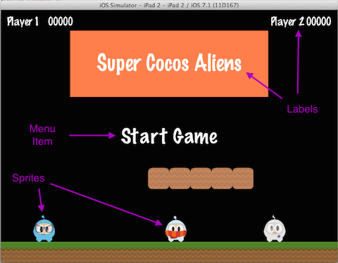

  <a href="#" class="btn" onclick="toggleLanguage()">中文</a>

# Basic Cocos2d-x Concepts
This chapter assumes you've just gotten started with Cocos2d-x, and are ready to
start working on the game of your dreams. Don't worry, it will be fun!

Let's get started!

Cocos2d-x is a cross-platform game engine. A game engine is a piece of software
that provides common functionality that all games need. You might have heard this
referred to as an API or framework but in this guide, we'll be calling it a
'game engine'.

Game engines include many components that when used together will help speed up
development time, and often perform better than homemade engines. A game engine
is usually comprised of some or all of the following components: a renderer,
2d/3d graphics, collision detection, a physics engine, sound, controller support,
animations and more.  Game engines usually support multiple platforms thus making
it easy to develop your game and then deploy it to multiple platforms without
much overhead at all.

Since Cocos2d-x is a game engine, it provides a simplified API for developing
cross-platform mobile and desktop games. By encapsulating the power inside an
easy to use API, you can focus on developing your games and worry less about the
implementation of the technical underpinnings. Cocos2d-x will take care of as
much or as little of the heavy lifting as you want.

Cocos2d-x provides `Scene`, `Transition`, `Sprite`, `Menu`, `Sprite3D`, `Audio`
objects and much more. Everything you need to create your games are included.

## Main Components
It might seem overwhelming at first, but getting started with Cocos2d-x is
simple. Before we dive into depth we must understand some of the concepts
Cocos2d-x utilizes. At the heart of Cocos2d-x are `Scene`, `Node`, `Sprite`,
`Menu` and `Action` objects. Look at any of your favorite games, and you will
see all of these components in one form or another!

Let's have a look. This might look a bit similar to a very popular game you might have
played:

Let's take another look, but splitting up the screenshot and identifying the
components used to build it:

You can see a menu, some sprites and labels, which all have an equivalent in
Cocos2d-x.  Take a look at a few of your own game design documents, and see what
components you have, you'll probably have a few that match up.
