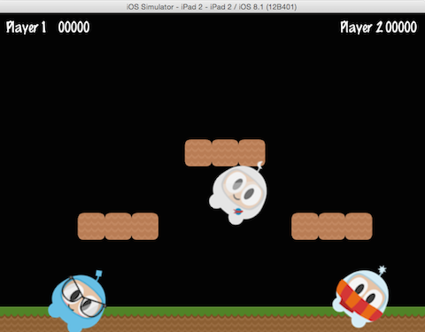

  <a href="#" class="btn" onclick="toggleLanguage()">中文</a>

## Parent Child Relationship
Cocos2d-x uses a __parent and child__ relationship. This means that properties
and changes to the parent node are applied to its children. Consider a single
`Sprite` and then a `Sprite` that has children:

With children, changing the rotation of the parent will also change the
rotation to all children:


auto myNode = Node::create();

// rotating by setting
myNode->setRotation(50);

<!--
var myNode = new cc.Node();

// rotating by setting
myNode.setRotation(50);-->



Just like with rotation, if you change the scale of the parent the children
will also get scaled:


auto myNode = Node::create();

// scaling by setting
myNode->setScale(2.0); // scales uniformly by 2.0

<!--
var myNode = new cc.Node();

// scaling by setting
myNode.setScale(2.0); // scales uniformly by 2.0-->



Not all changes to the __parent__ are passed down to its __children__. Changing the
__parent__ __anchor point__ only affects transform operations (*scale*, *position*,
*rotate*, *skew*, etc...) and does not affect children positioning. In fact, children
will be always added to the bottom-left (0,0) corner of its parent.
