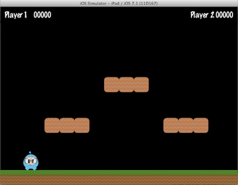
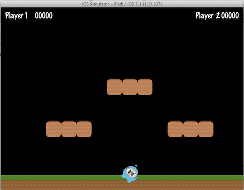
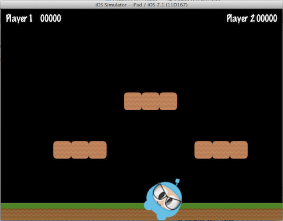
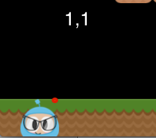

  <a href="#" class="btn" onclick="toggleLanguage()">中文</a>

## Sprites
All games have `Sprite` objects, and you may or may not realize what they are.
Sprites are the objects that you move around the screen.
You can manipulate them. The main character in your game is probably a
Sprite. I know what you might be thinking -  isn't every graphical object
a `Sprite`? No! Why? Well a Sprite is only a Sprite if you move it around. If you
don't move it around it is just a `Node`.

Taking another look at the image from above, let's point out what are
Sprites and what are Nodes:

Sprites are important in all games. Writing a platformer, you probably have
a main character that is made by using an image of some sort. This is
a `Sprite`.

`Sprites` are easy to create and they have configurable properties
like: __position__, __rotation__, __scale__, __opacity__, __color__ and more.


// This is how to create a sprite
auto mySprite = Sprite::create("mysprite.png");

// this is how to change the properties of the sprite
mySprite->setPosition(Vec2(500, 0));

mySprite->setRotation(40);

mySprite->setScale(2.0); // sets both the scale of the X and Y axis uniformly

mySprite->setAnchorPoint(Vec2(0, 0));
<!--
// This is how to create a sprite
var mySprite = new cc.Sprite(res.mySprite_png);

// this is how to change the properties of the sprite
mySprite.setPosition(cc._p(500, 0));

mySprite.setRotation(40);

mySprite.setScale(2.0); // sets both the scale of the X and Y axis uniformly

mySprite.setAnchorPoint(cc._p(0, 0));-->


Let's illustrate each property, consider the following screenshot from
the example code for this chapter:

If we set the position using `mySprite->setPosition(Vec2(500, 0));`:

Note that the `Sprite` position has changed from its original position to the
new position that we specified.

If we now set a new rotation, using `mySprite->setRotation(40);`:

... you can see that the `Sprite` has been rotated to the new amount that was
specified.

If we now specify a new scale using `mySprite->setScale(2.0);`:

Again, we can see that the `Sprite` now has changed according to our code
changes.

Lastly, all `Node` objects (since a `Sprite` is a subclass of `Node`) have a
value for __anchor point__. We haven't talked about this yet, so now is a good
time. You can think of __anchor point__ as a way of specifying what part of the
sprite will be used as a base coordinate when setting the position of it.

Using the character from our example game, and setting the anchor point to
__0, 0__ using:


mySprite->setAnchorPoint(Vec2(0, 0));

<!--
mySprite.setAnchorPoint(cc._p(0, 0));-->



would result in the lower left corner of our sprite being used as the basis for
any __setPosition()__ call. Let's see a few of these in action:

    

Take a look at the red dot in each picture. This red dot illustrates where
the anchor point is!

As you can see __anchor point__ is very useful when positioning `Nodes`. You
can even adjust the __anchor point__ dynamically to simulate effects in your
game.

We really can tweak just about every aspect of the `Sprite`. But, what if we
wanted to have these same types of changes occur in an automated, time
determined manner? Well, keep reading...
