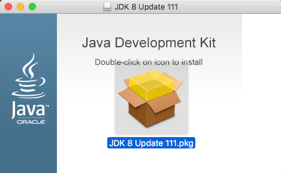
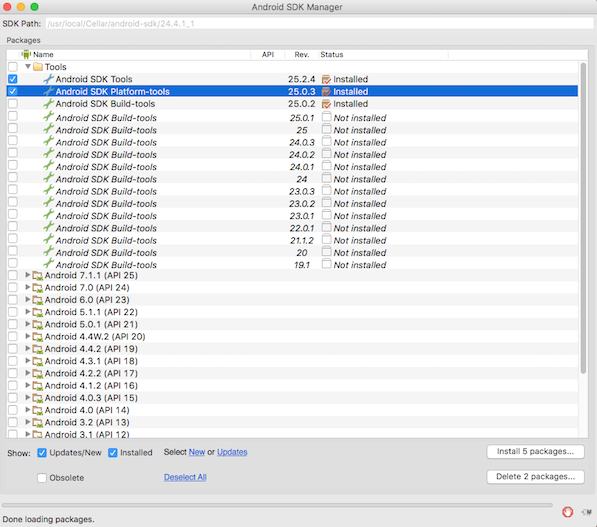
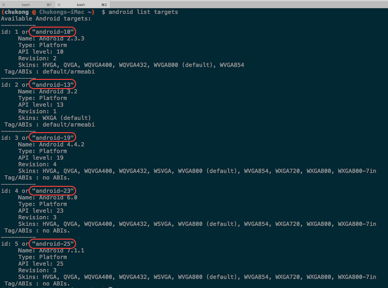

# Android with Command-line Installation and Setup

### Deprecated Document. Cocos2d-x V3.15 or less is the last supported version.

## Environment Requirements
A supported environment. See **[Installation Prerequisites](A/index.html)**

## Starting decisions
Android development is a complicated beast. Not only are there several development
environment options, each also requires several dependencies. These all need to be
working before you can attempt to build a Cocos2d-x project. Read these steps __a few__
times and take a few minutes to think about what workflow best suites you.

## Prerequisites
Before we even talk about Cocos2d-x specific tasks, you need a working Android
environment. This includes:

* JDK/SDK 1.6+ [http://www.oracle.com/technetwork/java/javase/downloads/index.html](http://www.oracle.com/technetwork/java/javase/downloads/index.html)

* Android NDK [https://developer.android.com/tools/sdk/ndk/index.html](https://developer.android.com/tools/sdk/ndk/index.html)

* Apache Ant [http://ant.apache.org/bindownload.cgi](http://ant.apache.org/bindownload.cgi)

* Python 2.7.5 [https://www.python.org/downloads/](https://www.python.org/downloads/) __NOT PYTHON 3__

Your system may already have some of these items. Download the items that you need
to inorder to have a complete environment. Nothing on this list can be missing.

## OS X Instructions

### Python
OS X systems come with __Python__ installed by default. Verify that your system
has __Python__ and ensusre that it is a version __less than 3__. From *Terminal.app*
or *iTerm 2* execute the following:
```sh
> python --version
```

If you see output, such as:
```sh
Python 2.7.10
```

You are good to go. If you see anything else you may need to install Python.
Use the link above. __You cannot move on in this document until this step is working.__

### JAVA
OS X systems usually *do not* come with JAVA installed. It is necessary to download and
install it using the link above. Make sure that you install the __JDK__. It is not enough
to just install the __JRE__.



Once installed, it is necessary to set __JAVA\_HOME__ in your __.bash\_profile__. Example:
```sh
export JAVA_HOME=$"(/usr/libexec/java_home -v 1.8)"
```

Once you are done with this step, __re-source__ your __.bash\_profile__: `source ~/.bash_profile`.
Now you can test that __JAVA__ is available on your system:
```sh
> java -v
```

You should see some version info as output. Example:
```sh
java version "1.8.0_111"
Java(TM) SE Runtime Environment (build 1.8.0_111-b14)
Java HotSpot(TM) 64-Bit Server VM (build 25.111-b14, mixed mode)
```

If you see any of the following types of errors, the __JDK__ is either not installed
or is not accessible. Verify you have set __JAVA\_HOME__. Example errors:
```sh
Unable to find any JVMs matching version "(null)".
Matching Java Virtual Machines (0):

No Java runtime present, requesting install.

Unable to find any JVMs matching version "(null)".
No Java runtime present, try --request to install.
```

If you are unsure, you can always execute `/usr/libexec/java_home -V` for a listing
of __JAVA JDKs__ on your system. Example:
```sh
> usr/libexec/java_home -V
Matching Java Virtual Machines (1):
    1.8.0_111, x86_64:	"Java SE 8"	/Library/Java/JavaVirtualMachines/jdk1.8.0_111.jdk/Contents/Home

/Library/Java/JavaVirtualMachines/jdk1.8.0_111.jdk/Contents/Home
```

### Apache Ant
__Apache Ant__ is another required tool. It is not installed on an OSX system by
default. It is neccessary to download it using the link above. Using a __binary__
distribution is fine. There is no need to download the source and compile by hand
unless this is your preferred method.

After downloading, unzip the __Apache Ant__ archive. You only need to place the
__Apache Ant__ folder someplace in your __$PATH__ and then set an __$ANT\_ROOT__
environment variable in your __.bash\_profile__. Exactly the same way __$JAVA\_HOME__
was added above. Example, if your __Apache ANT__ folder is named __apache-ant-1.10.0__:
```sh
export ANT_ROOT=/Applications/Cocos/tools/ant/bin
export PATH=$ANT_ROOT:$PATH
```

### Android NDK and SDK
Obviously, you need the __Android NDK and SDK__ to do Android development. These
are not installed on an OSX system by default. It is neccessary to download it
using the link above.

#### Brew
Using [__brew__](http://brew.sh/) is one option for installing the __Android NDK and SDK__.
Installing with __brew__ makes the installation simple. A single command, a few
environment variables and you are done. Example:
```sh
brew install android-ndk android-sdk
```

This will take a while to complete. Once it is done, you need to set a few
envorinment variables in your __.bash_profile__.
```sh
export NDK_ROOT=/usr/local/Cellar/android-ndk/r12b
export PATH=$NDK_ROOT:$PATH
export ANDROID_HOME=/usr/local/opt/android-sdk
export ANDROID_SDK_ROOT=/usr/local/Cellar/android-sdk/24.4.1_1
export PATH=$ANDROID_SDK_ROOT:$PATH
export PATH=$ANDROID_SDK_ROOT/tools:$ANDROID_SDK_ROOT/platform-tools:$PATH
```

Make sure to re-source your __.bash_profile__!

#### Installing manually.
If you choose not to use __brew__ you can still download and install the
__Android NDK and SDK__ by hand. After downloading, set the same environment
variables as above, but using your custom paths. For example, if you downloaded
the __Android NDK and SDK__ to __~/Projects/__:
```sh
export NDK_ROOT=/Users/username/Projects/android-ndk/r12b
export PATH=$NDK_ROOT:$PATH
export ANDROID_HOME=/Users/username/Projects/android-sdk
export ANDROID_SDK_ROOT=/Users/username/Projects/android-sdk/24.4.1_1
export PATH=$ANDROID_SDK_ROOT:$PATH
export PATH=$ANDROID_SDK_ROOT/tools:$ANDROID_SDK_ROOT/platform-tools:$PATH
```

#### Installing additional Android SDKs
Depending upon what Android OS versions you wish to target, you may need to
install additional __Android SDKs__ to cover those OS versions. As __Android SDKs__
evolve, sometimes older OS suppot is dropped. This means that your game might
not be able to target older devices. This is a personal decision on the part of
the game developer.

If you wish to install additional __Android SDKs__, use the built in __android__
GUI tool to install whatever you need. Example:
```sh
> android
```



It is only necessary to install the __Android SDK Tools__ for each release you
want installed on your system. It is always a good idea to update the __Android SDK Platform-Tools__
when a new version becomes available.


### Cocos2d-x
Installing __Cocos2d-x__ is probably the easiest part of this process. You can
get started with __Cocos2d-x__ by either downloading a self-contained
__.zip__ from the [website](http://cocos2d-x.org/download) or by cloning our
[GitHub Repo](https://github.com/cocos2d/cocos2d-x). Pick what works for you.
__There is no need to do both.__

#### By downloading a .zip archive
Download Cocos2d-x and unzip it. (maybe: __~/__ or __~/Projects__ )


#### Cloning from GitHub
Use the following commands to clone our GitHub repo and get your environment setup.
If you are not familar with GitHub's workflow, [learn it](https://guides.github.com/activities/hello-world/) or download
using the step above, __By downloading a .zip archive__.
```sh
cd <to where you want to clone this repo>

git clone git@github.com:cocos2d/cocos2d-x.git

git submodule update --init

git submodule update

./download-deps.py
```

### Making sure you are ready to create the next hit game!
Next, you are ready to build __cpp-tests__. It is a good idea to perform this
step before starting a new project. It ensures that your environment is setup
completely. If anything fails during this step, it is important to read the
error message carefully and re-visit the step above that is related to the
error message you see.

Change your directory to the where the __android-build.py__ script is located.
(usually __Cocos2d-x/build__). To see what targets are available. run:
```sh
> android list targets
```



Now you can execute the command to build:
```sh
> python android-build.py -p <target # from above> cpp-tests
```

Everything should build successfully!


## Starting a new project
Once everything above works, you can start a new project! To do this, read our
document on the **[Cocos Command-line tool](../editors_and_tools/cocosCLTool/)**.

## How to deploy it on your Android phone via command line

Enable **[USB Debugging](http://stackoverflow.com/questions/16707137/how-to-find-and-turn-on-usb-debugging-mode-on-nexus-4)**
on your phone and then connect your phone via USB.

Change your directory to the the **bin** directory of your android project

Use `adb` to install the __.apk__ to your Android phone by executing:
```sh
> adb install MyGame-debug.apk
```
