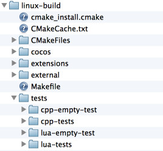

# Linux Installation and Setup

## Prerequisites
A supported environment. See **[Installation Prerequisites](A/index.html)**

## Setting up Cocos2d-x
* Download Cocos2d-x and unzip it. (maybe: ~/)

* Install dependencies. If you are using Ubuntu/Debian, there is a shell script
__build/install-deps-linux.sh__ for you to install the dependences easily. Run
the commands below, in a terminal:

    ```sh
    > cd $cocos2dx_root/build
    > ./install-deps-linux.sh
    ```

    Otherwise, you should install the dependencies manually. The dependencies are:

    ```sh
    libx11-dev
    libxmu-dev
    libglu1-mesa-dev
    libgl2ps-dev
    libxi-dev
    g++
    libzip-dev
    libpng12-dev
    libcurl4-gnutls-dev
    libfontconfig1-dev
    libsqlite3-dev
    libglew*-dev
    libssl-dev
    ```

## Building Cocos2d-x
* Run __cmake__ to generate __makefile__:

    ```sh
    > mkdir linux-build
    > cd linux-build
    > cmake ../..
    ```

* When __cmake__ finishes, many files & folders will be generated in
__coocs2dx_root/build/linux-build__

    

* Run __make__ to compile:

    ```sh
    > make
    ```

    Everything will be generated in __cocos2dx_root/build/linux-build/bin/cpp-tests/__
    if compiled successfully.

* Run `cpp-tests`

    ```sh
    > cd bin/cpp-tests/
    > ./cpp-tests
    ```

## Starting a new project
Once everything above works, you can start a new project! To do this, read our
document on the **[Cocos Command-line tool](../editors_and_tools/cocosCLTool/)**.
