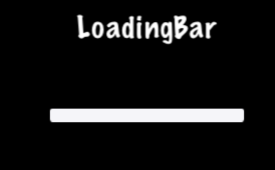

## LoadingBar
Have you ever played a game where you had to wait while it loaded up all the
content it needed? It probably showed you a bar, filling in as it made progress
accomplishing its task. This is often referred to as a __progress bar__, __status bar__
or a __loading bar__. Creating a `LoadingBar`:


# include "ui/CocosGUI.h"

auto loadingBar = LoadingBar::create("LoadingBarFile.png");

// set the direction of the loading bars progress
loadingBar->setDirection(LoadingBar::Direction::RIGHT);

this->addChild(loadingBar);


In the above example a __loading bar__ is created and we set the direction it
should fill towards as progress is made. In this case to the right direction.
However, you probably need to change the percentage of the `LoadingBar`. This is
easily done:


# include "ui/CocosGUI.h"

auto loadingBar = LoadingBar::create("LoadingBarFile.png");
loadingBar->setDirection(LoadingBar::Direction::RIGHT);

// something happened, change the percentage of the loading bar
loadingBar->setPercent(25);

// more things happened, change the percentage again.
loadingBar->setPercent(35);

this->addChild(loadingBar);


As you can see in the above example we specify a _.png_ image for the `LoadingBar`
objects texture:

On screen a `LoadingBar` might look like this:

