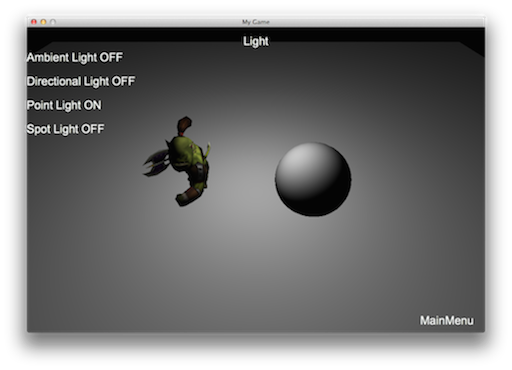

# 光照(Light)

光照对于烘托一个游戏的气氛非常重要, Cocos2d-x 目前支持四种光照技术. 使用不同的光照技术, 可以获得不同的光照效果.

## 环境光

环境光 `AmbientLight` 对场景中的所有内容均匀的应用光照, 模拟正常办公环境中的光照可以使用这种方式.

代码:


auto light = AmbientLight::create (Color3B::RED);
addChild(light);


效果:

## 定向光

定向光 `DirectionLight` 是来自特定方向的平行光. 因为所有的光线都是平行的，对于场景中的每个物体光的方向都保持一致，所以物体和光源的位置保持怎样的关系都无所谓. 定向光的一个很好例子是太阳光.

代码:


auto light = DirectionLight::create(Vec3(-1.0f, -1.0f, 0.0f), Color3B::RED);
addChild(light);


效果:

## 点光源

点光源 `PointLight` 从一个点向整个空间所有方向照射, 注意, 距离点光源越近, 受到的光照越强, 越远, 受到的光照越弱. 点光源的一个很好例子是灯泡.

代码:


auto light = PointLight::create(Vec3(0.0f, 0.0f, 0.0f), Color3B::RED, 10000.0f);
addChild(light);


效果:

## 聚光

聚光 `SpotLight` 是一种位于环境中某点的光源，只是它不是向所有方向照射，而是只朝某个方向照射。结果是只有一个聚光照射方向的确定半径内的物体才会被照亮，其他的都保持黑暗。聚光的一个很好的例子是手电筒的光。

代码:


auto spotLight = SpotLight::create(Vec3(-1.0f, -1.0f, 0.0f), Vec3(0.0f, 0.0f, 0.0f),
Color3B::RED, 0.0, 0.5, 10000.0f) ;
addChild(spotLight);


效果:

## 光照屏蔽

如果场景中被设置了多个光照, 但是你希望某一节点对象仅被其中一个光照影响, 而不是被多个光照影响, 那可以使用 `setLightFlag(LightFlag)` 函数进行控制. 要注意, 多个光照效果也是通过一次渲染完成的.

由于移动平台的性能问题, 不推荐使用多个光照, 默认光照的最大值为一, 如果要打开多个光源, 则必须要在 _info.plist_ 中定义以下配置:


<key> cocos2d.x.3d.max_dir_light_in_shader </key>
<integer> 1 </integer>
<key> cocos2d.x.3d.max_point_light_in_shader </key>
<integer> 1 </integer>
<key> cocos2d.x.3d.max_spot_light_in_shader </key>
<integer> 1 </integer>

