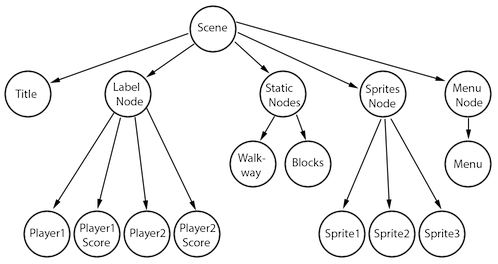

# 场景(Scene)

在游戏开发过程中，你可能需要一个主菜单，几个关卡和一个结束场景。如何组织所有这些分开的部分？使用 __场景(Scene)__ ! 当你想到喜欢的电影时，你能观察到它是被分解为不同场景或不同故事线。现在我们对游戏开发应用这个相同的思维过程，你应该很容易就能想出几个场景。

来看一张熟悉的图片：

这是一个主菜单场景, 这个场景是由很多小的对象拼接而成, 所有的对象组合在一起, 形成了最终的结果. 场景是被 __渲染器(renderer)__ 画出来的. 渲染器负责渲染精灵和其它的对象进入屏幕. 为了更好的理解这个过程, 我们需要讨论一下 __场景图__.

## 场景图(Scene Graph)

场景图(Scene Graph)是一种安排场景内对象的数据结构, 它把场景内所有的 __节点(Node)__ 都包含在一个 __树(tree)__ 上. (场景图虽然叫做"图",但实际使用一个树结构来表示).

听起来这好像很复杂, 可能你会问, 我为什么要关注这个技术细节, Cocos2d-x 值得我研究的这么深入吗? 值得! 这个对你真正了解渲染器是如何绘制场景的非常重要.

当你开发游戏的时候, 你会添加一些节点, 精灵和动画到一个场景中, 你期望的是每一个添加的对象都能被正确的展示, 可是如果有个对象没有被展示呢? 可能你错误的把这个对象隐藏到背景中了. 怎么办? 别着急, 这是个小问题, 停下来, 拿出一张纸, 把场景图画出来, 你肯定能很容易的发现错误.

既然场景图是一个树结构, 你就能遍历它, Cocos2d-x 使用 `中序遍历`, 先遍历左子树, 然后根节点, 最后是右子树.

初步了解了场景图, 让我们看一下这个游戏场景.

分解这个场景, 看一下它有哪些元素, 这些最终会被渲染为一个树

另一点要考虑的是, __z-order__ 为负的元素, z-order 为负的节点会被放置在左子树, 非负的节点会被放在右子树. 实际开发的过程中, 你可以按照任意顺序添加对象, 他们会按照你指定的 z-order 自动排序.

如上图, 左侧的场景是由很多节点对象组成的, 他们根据被指定的 z-order 相互叠加. 在 Cocos2d-x 中, 通过 `Scene` 的 `addChild()` 方法构建场景图.


// Adds a child with the z-order of -2, that means
// it goes to the "left" side of the tree (because it is negative)
scene->addChild(title_node, -2);

// When you don't specify the z-order, it will use 0
scene->addChild(label_node);

// Adds a child with the z-order of 1, that means
// it goes to the "right" side of the tree (because it is positive)
scene->addChild(sprite_node, 1);

// Adds a child with the z-order of -2, that means
// it goes to the "left" side of the tree (because it is negative)
scene.addChild(title_node, -2);

// When you don't specify the z-order, it will use 0
scene.addChild(label_node);

// Adds a child with the z-order of 1, that means
// it goes to the "right" side of the tree (because it is positive)
scene.addChild(sprite_node, 1);
