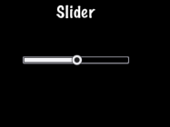

# 滑动条(Slider)

有时候你想平滑的改变一个值, 比如游戏设置中, 调整背景音乐的音量, 或着你有一个角色, 允许用户设置攻击敌人的力量. 这种场景最适合使用滑动条, Cocos2d-x 提供 __`Slider`__ 对象支持滑动条.

创建滑动条:


#include "ui/CocosGUI.h"

auto slider = Slider::create();
slider->loadBarTexture("Slider_Back.png"); // what the slider looks like
slider->loadSlidBallTextures("SliderNode_Normal.png", "SliderNode_Press.png", "SliderNode_Disable.png");
slider->loadProgressBarTexture("Slider_PressBar.png");

slider->addTouchEventListener([&](Ref* sender, Widget::TouchEventType type){
        switch (type)
        {
                case ui::Widget::TouchEventType::BEGAN:
                        break;
                case ui::Widget::TouchEventType::ENDED:
                        std::cout << "slider moved" << std::endl;
                        break;
                default:
                        break;
        }
});

this->addChild(slider);


从上面的例子, 可以看出, 实现一个滑动条需要提供五张图像, 对应滑动条的不同部分不同状态, 分别为: 滑动条背景, 上层进度条, 正常显示时的滑动端点, 滑动时的滑动端点, 不可用时的滑动端点. 本次示例的五张图像如下:

   
   

在屏幕上一个滑动条看起来是这样的:

